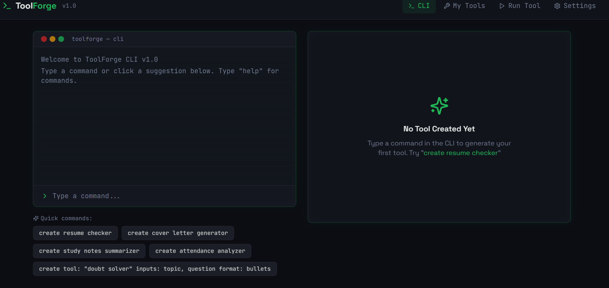
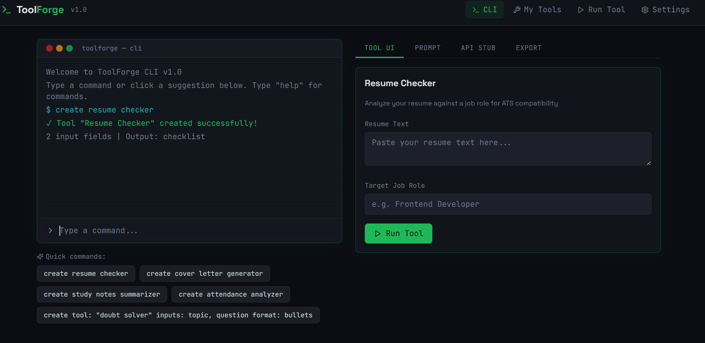
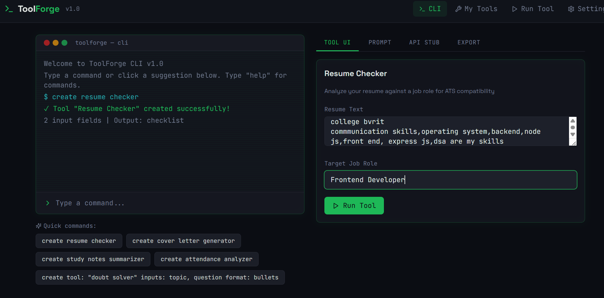
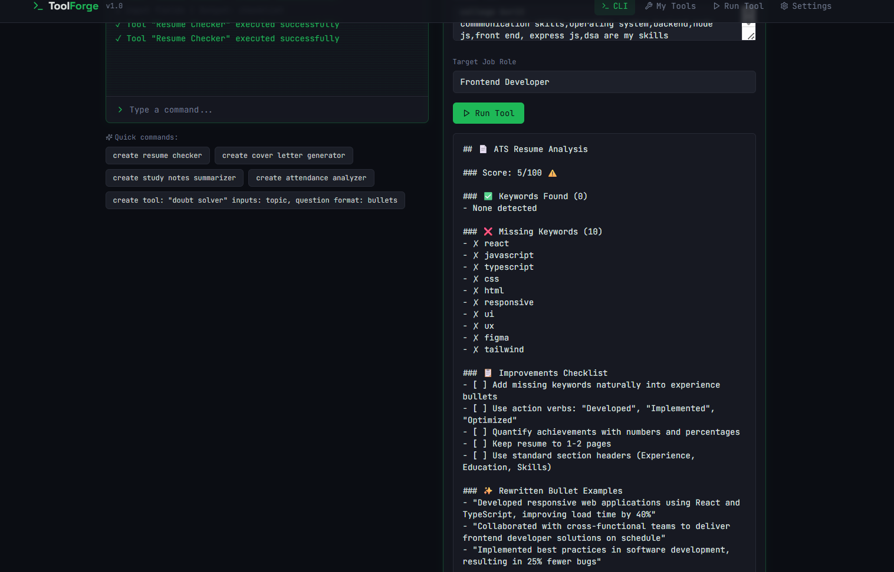
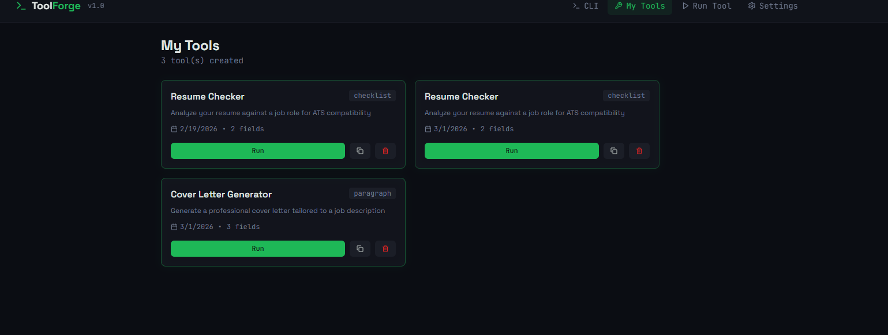
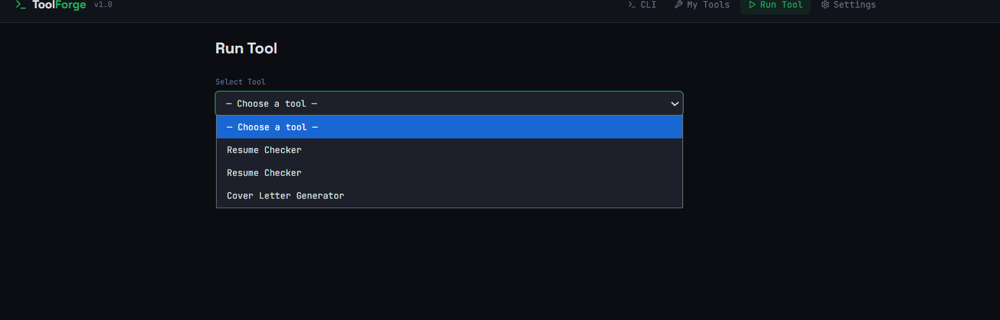

# StudyMateAI 🚀
## 🌐 Project Website (GitHub Hosted)
https://tejuu-k.github.io/StudyMate/

## 🚀 Live Application
https://studymatetool.lovable.app/

StudyMateAI is an AI-powered study assistant built using Lovable ToolForge.

## 🔥 Features
- Study Notes Summarizer
- Resume Checker
- Cover Letter Generator
- Doubt Solver
- Attendance Analyzer

## 🌐 Live Demo
https://studymatetool.lovable.app/

## 🛠 Built With
- Lovable AI Builder
- ToolForge CLI

## 🎯 Problem It Solves
Students struggle to manage study tasks and career preparation tools in one place. StudyMateAI centralizes them into a single AI-powered platform.

## 📸 Screenshots

